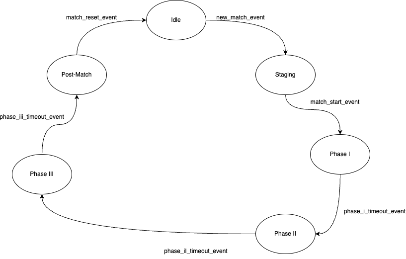
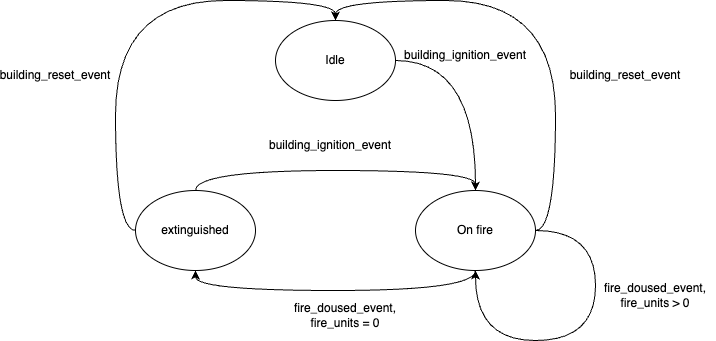
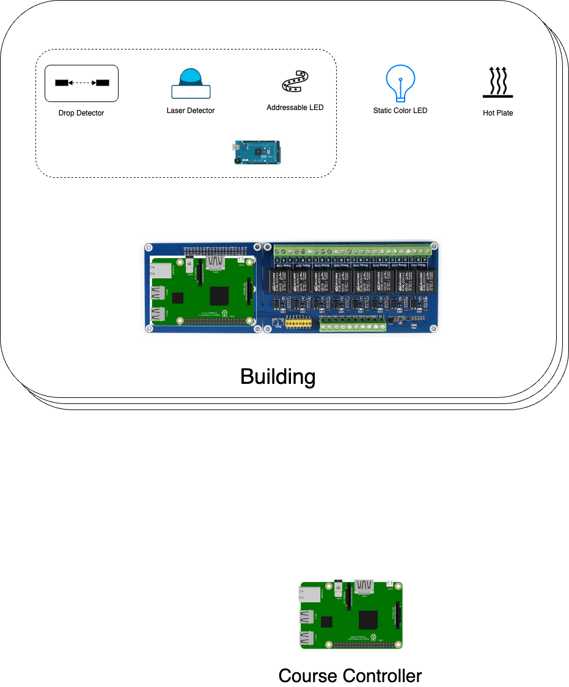

# AVR Smart Court Controls

Field control software for an autonomous drone competition "smart court."  
Students fly inside a physical court with interactive buildings, and this repo runs the software that drives the game logic and building hardware.

## System Overview

The smart court is a distributed, containerized system connected by an MQTT backbone:

- 1 central controller node (`CONTROLLER`)
- 9 building nodes (`"1"` through `"9"`)

Building interactions are split into three challenge types:

- 3 hotspot buildings use relay-actuated candle warmers (thermal targets for drone thermal cameras)
- 3 fire buildings use laser detectors (students hit sensors with a drone laser to "put out fires")
- 3 fire buildings use ball-drop receptacles (students drop balls; buildings count hits to simulate suppression)

The controller is the central brain. It runs the game/match state machine, ingests building events, and awards score based on current phase/state.

## Architecture

- **MQTT broker (`mosquitto`)** is the event bus for all system traffic.
- **Controller app** subscribes to building and UI events, maintains match state, and publishes commands/state updates.
- **Building adapter app** runs on each building node, bridges Arduino + relay hardware to MQTT.
- **Node-RED** provides UI/integration flows on the controller node.
- **Ansible** provisions hosts and deploys/starts/stops container workloads across all nodes.

## Repository Layout

- `controller_modules/controller/`: Python game controller (match model, scoring, command publishing)
- `controller_modules/mqtt/`: Mosquitto config
- `controller_modules/nodered/`: Node-RED flows/settings
- `buildings/pi/arduino-adapter/`: Python service that handles GPIO relays + serial to Arduino + MQTT
- `buildings/arduino/`: Arduino firmware (laser/ball sensing + LED control)
- `ansible/plays/`: orchestration entrypoints (`provision`, `deploy`, `start_all`, `stop_all`, `reboot`)
- `ansible/actions/`: reusable deployment tasks/templates
- `ansible/inventories/`: court inventories (`court_1.yaml`, `court_2.yaml`, `court_3.yaml`)
- `exports/`: expected Docker image tarballs for offline shipping to targets

## Controller Software

Main code lives in `controller_modules/controller/src/`.

Responsibilities:

- Maintains match state and phase timing
- Tracks fire/heater building state
- Consumes building events from MQTT (`+/events/#`)
- Applies scoring logic per phase
- Publishes UI state (`ui/state/...`)
- Publishes building relay commands (`<building_id>/relay/set`)
- Publishes building LED/progress commands (`<building_id>/progress_bar/set`)
- Writes match logs to `/logs` on the controller host

Local controller stack composition is defined in `controller_modules/docker-compose.yaml`:

- `mqtt` (Eclipse Mosquitto)
- `nodered`
- `controller`




## Building Software/Hardware


### Pi Adapter (`buildings/pi/arduino-adapter`)

Runs in a privileged container on each building node:

- Reads per-building config (`/app/configs/config.json`)
- Connects to MQTT broker
- Subscribes to relay and LED commands for its building ID
- Bridges serial messages from Arduino to MQTT events (`laser` -> `<id>/events/laser_detector/`, `ball` -> `<id>/events/ball_detector/`)
- Controls relay outputs for heater/light/window/hopper channels

Container definition: `buildings/pi/docker-compose.yaml`

### Arduino Firmware (`buildings/arduino`)

Firmware for Arduino Mega:

- Detects ball drop and laser hits
- Emits events over serial to Pi adapter
- Receives LED pixel commands over serial
- Built with PlatformIO (`buildings/arduino/platformio.ini`)

## MQTT Event Flow

- Building sensors -> MQTT events (`<id>/events/...`)
- Controller consumes events -> updates match model/score
- Controller -> building commands (`<id>/relay/set`, `<id>/progress_bar/set`)
- Controller -> UI state (`ui/state/...`)

## Deployment and Orchestration (Ansible)

Ansible is used to manage all nodes and deploy container images/configs.

### Inventories

Inventories are in `ansible/inventories/` and define:

- controller + building host IPs
- SSH user/password variables
- per-host container image tar assignments
- building runtime config (MQTT broker, serial port, interface, relay channels)

### Playbooks

- `ansible/plays/provision.yaml`: reachability checks, optional clock sync, hostname setup, network wait tweaks
- `ansible/plays/deploy.yaml`: pushes image tarballs from `exports/`, loads images, ships configs and compose files
- `ansible/plays/start_all.yaml`: runs `docker compose up -d` on target hosts
- `ansible/plays/stop_all.yaml`: runs `docker compose down` on target hosts
- `ansible/plays/reboot.yaml`: reboots reachable targets

### Running Playbooks

From repo root:

```bash
ansible-playbook ansible/plays/provision.yaml -i ansible/inventories/court_1.yaml -e "pw=<ssh_password>"
ansible-playbook ansible/plays/deploy.yaml -i ansible/inventories/court_1.yaml -e "pw=<ssh_password>"
ansible-playbook ansible/plays/start_all.yaml -i ansible/inventories/court_1.yaml -e "pw=<ssh_password>"
ansible-playbook ansible/plays/stop_all.yaml -i ansible/inventories/court_1.yaml -e "pw=<ssh_password>"
```

Limit to specific hosts when needed (example: controller + buildings 1,3,4):

```bash
ansible-playbook ansible/plays/start_all.yaml -i ansible/inventories/court_1.yaml -e "pw=<ssh_password>" --limit="CONTROLLER,1,3,4"
```

You can also run Ansible from a container using `ansible/docker-compose.yaml`.

## Image Packaging Expectations

Deploy tasks expect image tarballs in `exports/`, referenced by inventory values:

- `field_controller.tar`
- `arduino.tar`
- `mosquitto.tar`
- `nodered.tar`

If those tarballs are missing, deployment will fail when the playbook tries to synchronize/load images.

## Development Notes

- Controller local stack: `docker compose -f controller_modules/docker-compose.yaml up --build`
- Building adapter local stack: `docker compose -f buildings/pi/docker-compose.yaml up --build`
- Arduino firmware work: `buildings/arduino/` (PlatformIO)

## License

MIT, see `LICENSE`.
